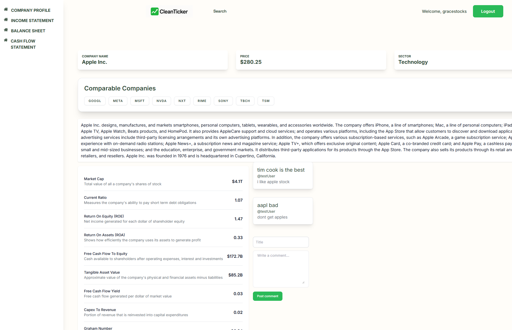
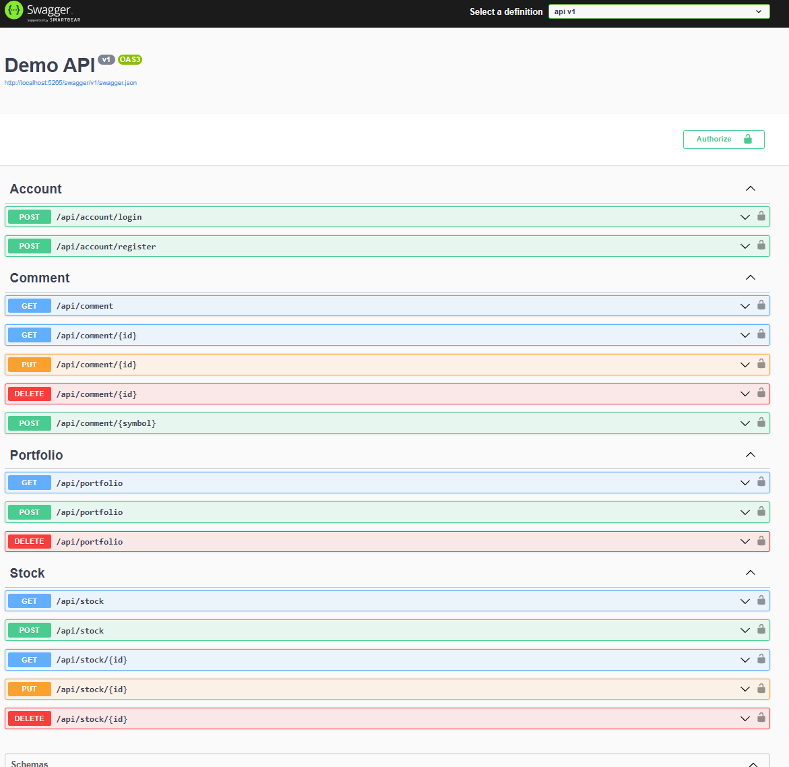
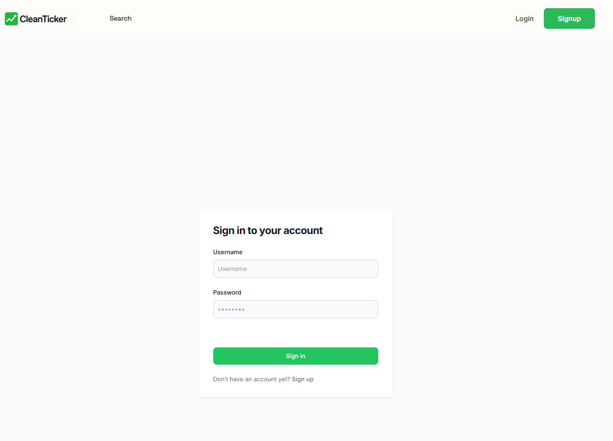

# stockPortfolioApp

This project is based off a tutorial (credit to Teddy Smith). It is a React finance app that calls an external API (FMP API) to get data on stocks and displays balance sheets, income statements and cash flow statements for each.

[Click here](https://www.youtube.com/watch?v=XSLm9PHnkxI&list=PL82C6-O4XrHcNJd4ejg8pX5fZaIDZmXyn) to find the tutorial.

The backend ASP.NET Web API performs CRUD operations on the SQL database to allow users to manage and store their own portfolio of stocks.

Tech stack:

- React Typescript front end
- ASP.NET Core Web API backend
- Entity Framework Core
- ASP.NET Core JWT Identity
- React Typescript Context Auth JWT
- Tailwind CSS
- SQL Server

## Company Financial Dashboard View

## API Endpoints

## Login Page

